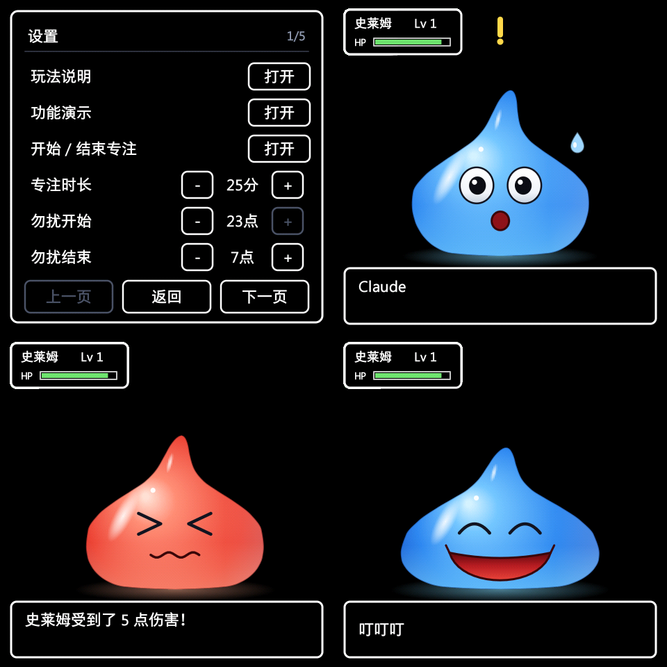
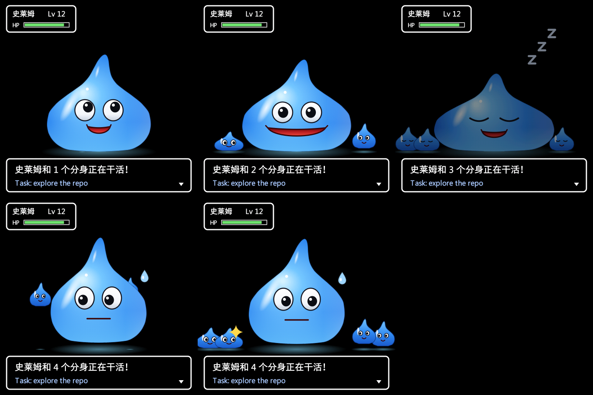

# Slime Pet

[中文](README.md) · **English**

A desktop pet slime that lives on the [ESP-Mosaico](https://github.com/esp-mosaico/esp-mosaico-bsp) board (ESP32-S31, 480×480 AMOLED). It follows your Claude Code sessions: it thinks while Claude thinks, shows what Claude is working on, and calls you, flashes and vibrates when Claude needs your approval. It can also see you, hear you, and feel you shaking it.

> The device and the web panel speak Chinese or English: pick **Language** at the top of the device settings, or use the EN / 中文 button in the panel. Both switch together.


| On-screen UI: settings / awaiting approval / hurt by a failed command / task done | Helper slimes pop out when Claude spawns subagents |
|:---:|:---:|
|  |  |

> Want to build your own with an AI coding agent? See [docs/PROMPTS.en.md](docs/PROMPTS.en.md): staged prompts with acceptance checks and the pitfalls we hit.

## Features

| | |
|---|---|
| **Claude Code** | Thinking / working (shows the tool and command) / waiting for your approval (calls you, flashes, vibrates) / earns EXP and levels up when a task finishes / gets hurt when a command fails. When Claude starts subagents, that many little helper slimes pop out beside it and hop back when they finish. Keeps several sessions apart. Over Wi-Fi, with USB as the fallback |
| **AI comments** | After each Claude turn, a local model on your computer (LM Studio) writes a one-line comment in the slime's voice, e.g. "All tests pass, nice!". By default the transcript only goes to that local model, never to the cloud; any OpenAI-compatible cloud API also works |
| **Memory and personality** | The computer side logs every event in the slime's journal; the last 7 days of your habits shape its personality (night owl, confident, worrier, workaholic, ...) and the tone of its comments; it writes a diary every day |
| **Proactive companion** | With `slime_buddy.py` running, it speaks up when Claude has waited for your approval too long, commands keep failing, you work deep into the night or for hours on end, you finish a lot today, or you come back after a while |
| **Voice chat** | Hold the AI key and speak; the computer turns the recording into text and the slime answers with what it remembers, e.g. "What was Claude just doing?" |
| **Touch and buttons** | Tap to poke it, hold 1 s for the settings menu; AI key: click to mute, hold to talk (or for the help page with voice off); BOOT key: click to start/stop focus, hold for settings; the Interaction module's left/right keys set the volume |
| **Motion** (on-board IMU) | Tilt it and it slides, shake it and it gets dizzy, lay it face down and it sleeps |
| **Microphone** | Clap twice to say hi; it bobs to the beat of music (keyboard typing is ignored) |
| **Camera** (optional module) | Its eyes follow you; tilt your head and it tilts too; nod and it's happy, shake your head and it sulks; stare and it gets shy; cover the lens for peekaboo; reminds you to get up after sitting too long; a corner thumbnail shows what it sees. All computed on the device; no picture leaves it |
| **Sound** | Three-voice chiptune synthesizer (MML scores plus pitch glides) with an original boot tune, cues and two background tunes; a built-in sfxr engine lets you generate and swap any sound from the web panel |
| **Interaction module** (optional) | 6 RGB LEDs follow the state; buttons, PIR, light sensor |
| **Everyday** | Chinese / English UI, clock and time-of-day greetings, quiet hours, a focus timer, sitting reminders, a help page, and a one-press feature demo for recording videos |
| **Web panel** | Open `http://slime.local/`: live status, every setting, sound preview, custom sounds, the camera picture |
| **Wireless updates** | Two-slot OTA; a new image must run for 30 s before it confirms itself, and a crash before that rolls back to the old one |

## Hardware

- **ESP-Mosaico board** (ESP32-S31, 480×480 AMOLED, touch, BMI270 IMU, ES8311 audio, vibration motor, fuel gauge). Needs ESP-IDF 6.2 or newer (currently only the master branch)
- Optional: the **Interaction module** (either slot, hot-pluggable) and the **camera module** SC101IOT (left slot only)

Wi-Fi is 2.4 GHz only.

## Quick start

```bash
git clone https://github.com/8Avalon8/slime-pet && cd slime-pet
git clone https://github.com/esp-mosaico/esp-mosaico-bsp third_party/esp-mosaico-bsp

cd firmware/slime
. $IDF_PATH/export.sh                      # ESP-IDF master
idf.py --preview set-target esp32s31
idf.py build > /tmp/slime_build.log && grep "Project build complete" /tmp/slime_build.log
```

**First flash (USB)**: connect the board's Type-C port with a data cable.

```bash
python tools/backup_and_flash.py
```

The first run saves the whole flash (the factory firmware) to `backup/` in the repository root, and every later flash backs up the settings area first. The script reboots the device into download mode by itself; no buttons needed.

**Wi-Fi**: run this in your own terminal. The password is not echoed, goes to the device only over the USB cable, and is never written to disk.

```bash
python3 ../../bridge/wifi_setup.py
```

**From then on, update over Wi-Fi**:

```bash
idf.py build > /tmp/slime_build.log
python tools/ota_flash.py
```

The first wireless update fetches an update token from the device over USB and caches it in `bridge/.ota_token`; after that no cable is needed.

**Hook up Claude Code** (from the repository root):

```bash
python3 bridge/install_hooks.py            # merges into ~/.claude/settings.json, after a backup
python3 bridge/install_hooks.py --uninstall
```

The hooks are asynchronous and never slow Claude down; when the device is offline they fail silently.

**Windows / Linux**: the `bridge/` scripts work there too, still stdlib-only (use `python` instead of `python3`). On Windows the COM port is found in the registry by Espressif's USB vendor id (303A); on Linux under `/dev/serial/by-id/`. Set `SLIME_PORT` (e.g. `SLIME_PORT=COM5`) if it is not found. `install_hooks.py` writes the Python that runs it into the hook command. The firmware tools (`backup_and_flash.py`, `ota_flash.py`) are still macOS-only.

**AI comments** (optional): in [LM Studio](https://lmstudio.ai/), download `gemma-4-e4b-it` and start the local server (default `http://localhost:1234`). After each Claude turn that used tools, the hook writes a comment in the background and sends it to the slime. Turn it off in the device settings, or with `SLIME_AI=0` on the computer; `SLIME_LLM_URL` / `SLIME_LLM_MODEL` pick another endpoint or model (local servers such as Ollama work as is). Comments follow the device language (the bridge asks the device over Wi-Fi); `SLIME_LANG=zh|en` overrides it.

To use a cloud API (OpenAI, DeepSeek, OpenRouter or any other OpenAI-compatible endpoint), also set `SLIME_LLM_KEY`, for example:

```bash
export SLIME_LLM_URL=https://api.deepseek.com/v1
export SLIME_LLM_MODEL=deepseek-chat
export SLIME_LLM_KEY=sk-...
```

An easier place for these three values (and the speech-to-text address, model and key below) is the web panel: open "AI settings" at `http://slime.local/`. Once saved, the hook and the buddy read them from the device, with no environment variables needed; an environment variable still wins when set. The panel never shows a saved API key again, and the computer side can only read it with `bridge/.ota_token` (the update token fetched on the first wireless update). The key travels unencrypted on your network, so enter it only on a network you trust. `python3 bridge/slime_brain.py config` shows where each value currently comes from.

Note that each turn's condensed summary (the first 300 characters of your request, the last few tool calls, and the first 600 characters of Claude's last reply) then goes to that provider. File contents and tool output are never included.

**Memory, proactive lines and voice chat** (optional): the hook logs every event to `bridge/.slime/journal/` (on this computer only, kept for 60 days), and the comments follow the personality those records shape. Proactive lines, the diary and voice chat need a resident process in another terminal (Windows, macOS or Linux; stdlib only; over Wi-Fi):

```bash
python3 bridge/slime_buddy.py              # Ctrl-C to stop; -v logs every decision
python3 bridge/slime_buddy.py diary        # write today's diary now (it writes yesterday's after midnight anyway)
python3 bridge/slime_buddy.py ask "今天干了啥"   # try a voice answer without the microphone
python3 bridge/slime_brain.py traits       # the personality it has grown so far
```

It reads the same environment variables as the hook (`SLIME_LLM_URL` / `SLIME_LLM_MODEL` / `SLIME_LLM_KEY`), so set them in the buddy's terminal too. Diaries go to `bridge/.slime/diary/`.

Voice chat also needs a speech-to-text endpoint (OpenAI-compatible `/audio/transcriptions`). It defaults to `SLIME_LLM_URL` and `SLIME_LLM_KEY` with model `whisper-1`, so OpenAI works without extra settings. LM Studio has no speech to text; locally, a compatible server such as [Speaches](https://github.com/speaches-ai/speaches) works:

```bash
export SLIME_STT_URL=http://localhost:8000/v1
export SLIME_STT_MODEL=Systran/faster-whisper-small
```

To talk: hold the AI key, speak once the screen says it is listening (up to 10 s), release and wait for the answer. It records only while you hold the key, and the device serves each recording once. Your voice and the conversation go to the speech and model endpoints you configured. Turn off "长按 AI 键说话" in the device settings to get the help page back on a long press.

## Repository layout

| Path | Contents |
|---|---|
| `firmware/slime/components/slime_core/` | Rendering core in plain C, no ESP-IDF dependency: rasterizer `sg`, state machine and jelly springs `slime_anim`, renderer `slime_render`, text `slime_text`, menu `slime_menu` |
| `firmware/slime/main/` | Device side: main loop and "brain" (`main.c`), Claude Code session tracking `cc_track`, sensors `sensors`, audio and synthesizers `audio`/`sfxr`, scores `tunes_original.h`, camera and face `vision`, networking `net`, web panel `web`, settings `config`/`settings_ui`, wireless updates `ota`, crash records `bootlog` |
| `firmware/slime/host/` | Host test program: renders images, benchmarks and runs unit tests with the same rendering code |
| `firmware/slime/tools/` | USB flashing, wireless updates, glyph generation |
| `firmware/slime/bootloader_components/` | Bootloader hook that holds the power on at once (otherwise the board cannot boot on battery) |
| `firmware/slime/patches/` | A patch to the official BSP, applied automatically at build time |
| `bridge/` | Computer side: Claude Code hook `slime_hook.py`, memory and model calls `slime_brain.py`, the resident companion `slime_buddy.py` (proactive lines, diary, voice chat), Wi-Fi setup |
| `design/slime_preview.html` | Browser design draft: the source of the look, the states and the jelly physics parameters |

## Rendering and testing on your computer

```bash
cd firmware/slime/host
make sheet       # out/sheet.png: every state side by side
make test        # cc_track unit tests + pixel-exact check of the dual-core split rendering
./host_sim frame levelup 1.5 out/frame.bmp "叮叮叮！升到了 Lv 13！"
./host_sim helpers 3 2 work out/helpers.bmp   # 3 helper slimes, 2 s after they were sent out
```

**No board?** `make sim` runs the real firmware on your computer (poke, shake and press keys in a window; point the Claude Code hook at it with `SLIME_HOST=127.0.0.1:8080`), and `make simtest` is a scripted end-to-end test. To test only the hook, use `bridge/fake_device.py`. See [firmware/slime/host/README.md](firmware/slime/host/README.md).

(PNG output uses macOS `sips`; elsewhere, look at the BMP.)

## Customising

- **Music**: scores live in `main/tunes_original.h`, written in MML (syntax at the top of `audio.c`). To use your own, put the same two tables in `main/tunes_local.h`: that file is ignored by git and replaces the bundled tunes when present.
- **Sounds**: the panel's custom sound section generates sfxr sounds at random, or takes JSON exported from [sfxr.me](https://sfxr.me/), and swaps the sound of any event. Stored on the device; no rebuild needed.
- **Text and font**: every character used in the source is pre-rendered at three sizes, plus a 22 px table of the 3,755 most common Chinese characters for dynamic text such as AI comments. After changing strings in the code, regenerate the glyphs (needs Pillow and [Noto Sans SC](https://fonts.google.com/noto/specimen/Noto+Sans+SC)):

  ```bash
  python3 tools/gen_glyphs.py path/to/NotoSansSC.ttf
  ```

  Latin text works out of the box, since printable ASCII is always included. Every on-device string is written as `SL_TR("中文", "English")` (`slime_text.h`); the English side sticks to ASCII so it needs no extra glyphs. The web panel keeps its English text in `main/web/index.html` (`EN_TEXT` and the `T()` calls).

## Troubleshooting

- **Won't boot, no serial port**: start `python tools/backup_and_flash.py` first; it waits for a port. Then hold BOOT and press PWR to enter the chip's own download mode (the screen stays black and the port name changes, e.g. `usbmodem2101`); flashing starts by itself. Settings and progress live in a separate area and are kept.
- **Froze or restarted by itself**: a task stuck for 5 s triggers a watchdog reboot, and the crash is recorded. Open `http://slime.local/api/status` and look at `crash`: the task name and addresses, which `addr2line` on the built ELF turns into source lines.
- **Certificate errors when ESP-IDF downloads components on macOS**: `export SSL_CERT_FILE=/etc/ssl/cert.pem` first.

## Security

- The web panel has **no login**; use it only on your own home network. Voice recordings are fetched through it too (`/api/voice.wav`, which exists only after you held the AI key to talk, and only until it is fetched once).
- The Wi-Fi password is set over USB (`wifi_setup.py`) or from the web panel; no interface reads it back and it never appears in logs.
- Wireless updates need a token that is only available over USB; the device also checks that the image belongs to this project and verifies its SHA-256.

## License

MIT, see [LICENSE](LICENSE). Third-party material (Noto Sans SC glyphs, sfxr, the BSP patch) is listed in [THIRD_PARTY.md](THIRD_PARTY.md).

This is a hobby project. The slime is a generic retro-RPG-style character, not affiliated with any game company, and the repository contains no music or assets from any game.
